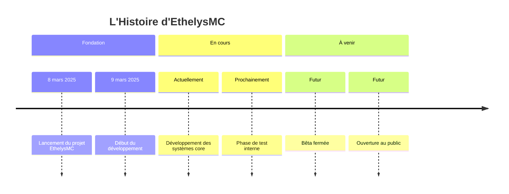

<h1 align="center">
  
</h1>

<p align="center">
  
</p>

<div align="center">
  
  
  
</div>

<br>

<div align="center">
  
  
</div>

## 💫 À propos d'EthelysMC

<div align="center">
  
</div>

```javascript
const ethelys = {
  nom: "EthelysMC",
  fondateur: "Rémi",
  version: "1.0",
  technologies: ["Java", "Spigot", "MongoDB"],
  caractéristiques: ["Mini-jeux", "PvP"],
  vision: "Créer une expérience Minecraft unique et immersive",
  création: "8 mars 2025",
};
```

EthelysMC est un projet de serveur Minecraft innovant, conçu pour offrir une expérience de jeu unique et captivante. Fondé par **Rémi**, un développeur passionné, ce projet combine créativité et expertise technique pour proposer un univers riche aux joueurs.

<br>

## 🌟 Notre Vision

<div align="center">
  <a href="https://ethelys.fr">
    
  </a>
</div>

<p align="center">
  
</p>

<details>
  <summary><b>🎮 Découvrir EthelysMC en profondeur</b></summary>
  
  <br>
  
  <div align="center">
    
  </div>
  
  ### 🚀 Notre Mission
  EthelysMC a pour mission de créer un environnement de jeu où la créativité, le challenge et la communauté sont au cœur de l'expérience. Nous souhaitons offrir un serveur où chaque joueur trouve sa place et peut s'épanouir.
  
  ### 🛠️ Développement et Innovation
  - Systèmes de jeu uniques et équilibrés

  ### 🔮 Notre Avenir
  Lancé très récemment, le projet EthelysMC a une vision ambitieuse pour son développement. Nous travaillons activement sur la création d'une expérience de jeu exceptionnelle. Suivez-nous pour être informé de notre progression et des annonces d'ouverture !
</details>

## 🧰 Nos Technologies

<div align="center">
  
  
  
  
  
  
</div>

<div align="center">
  
</div>

## 📈 Notre Histoire




## 📫 Nous Suivre

<div align="center">
  
  <a href="https://discord.ethelys.fr">
    
  </a>
  <a href="https://ethelys.fr">
    
  </a>
  <a href="https://github.com/EthelysMC">
    
  </a>
  
</div>

---

<div align="center">
  
</div>
